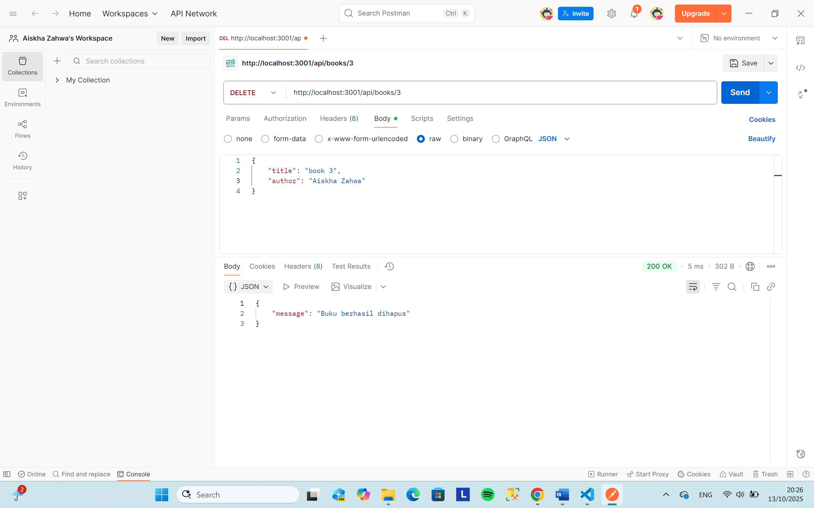
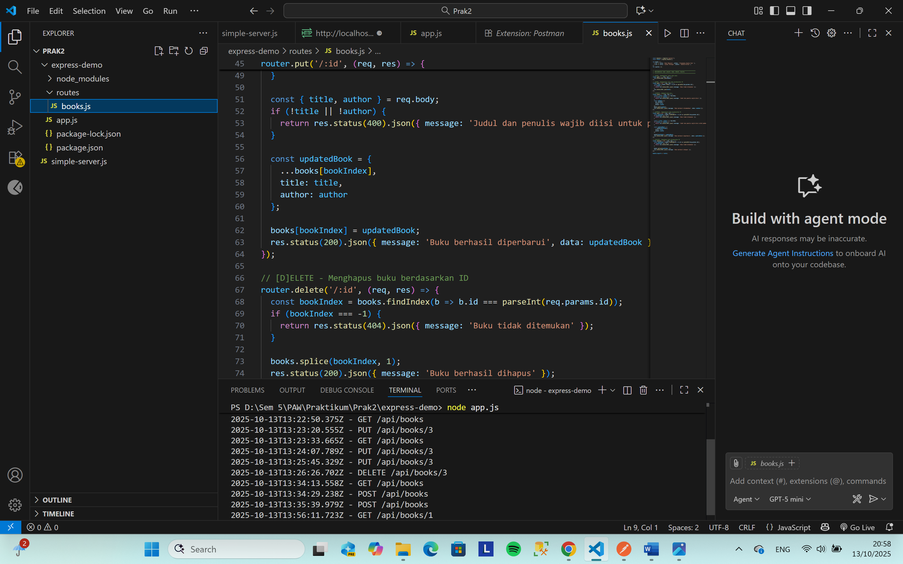
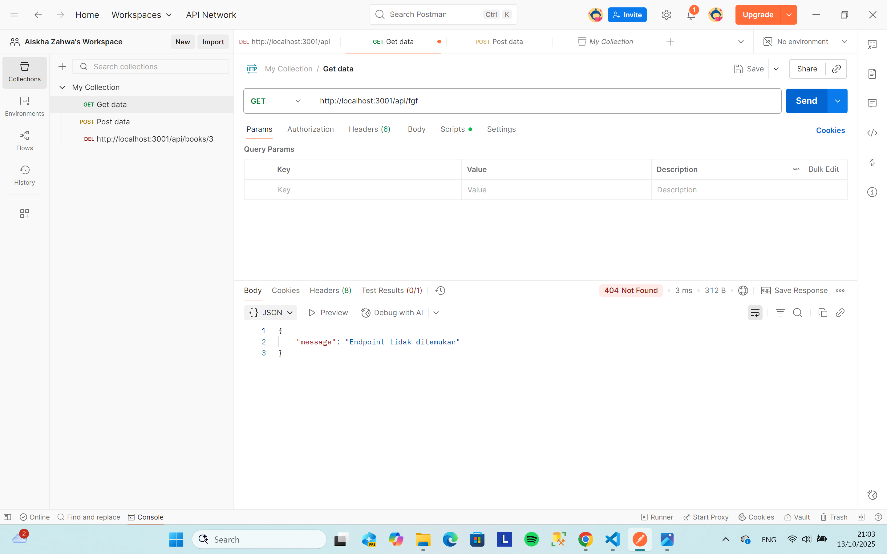
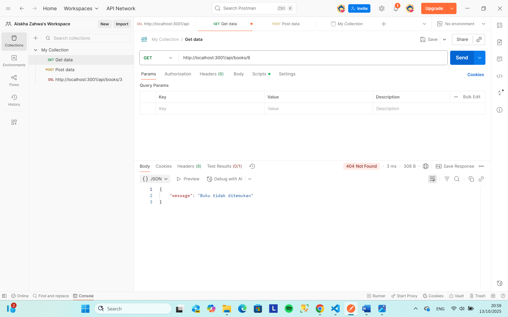

# Tugas 2 - Membuat Server HTTP dengan Node.js dan Express.js

**Nama:** Aiskha Zahwa Rayya
**NIM:** 20230140146
**Kelas:** C
**Kelas:** Praktikum PAW  

---

## Screenshots Hasil Praktikum

### 1. GET All Books
.png)

### 2. GET Book by ID
.png)

### 3. POST Book
.png)

### 4. PUT Book
.png)

### 5. DELETE Book

### 6. Middleware Logging

### 7. Error Handling 404

### 8. Book Not Found
